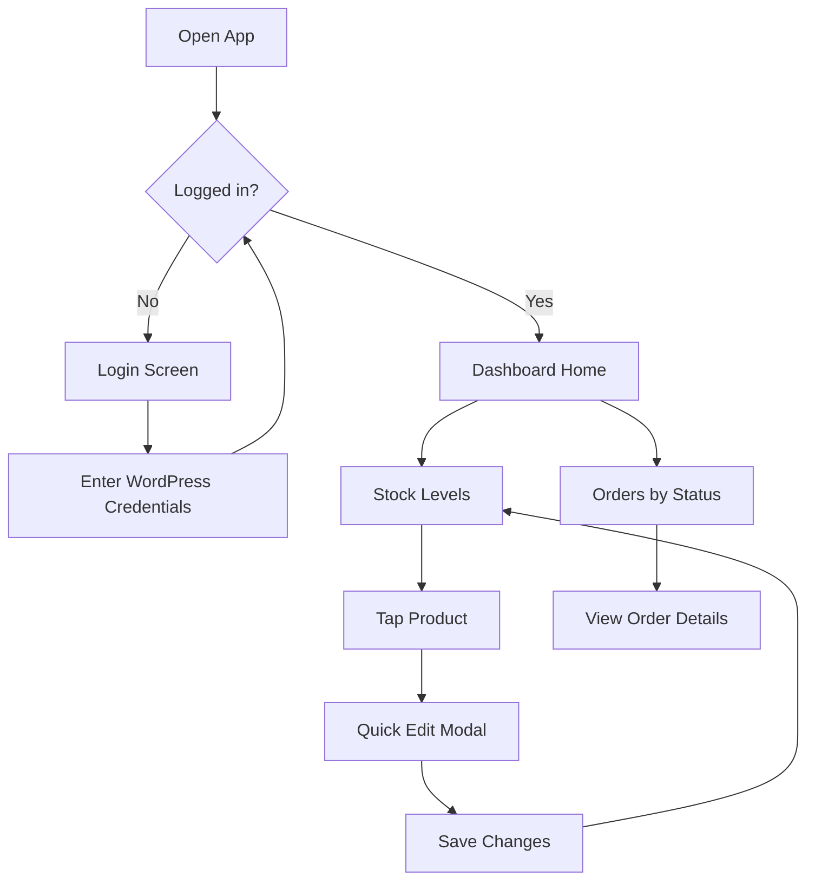

# Mobile WooCommerce Dashboard

## Overview

A mobile-first admin dashboard that connects to your WordPress store, showing live inventory and orders with quick editing capabilities.

**Login required:** Since this dashboard edits product prices and quantities, you'll need to log in with your WordPress admin account.

---

## Dashboard Screens

### 1. Login Screen
- Username/email and password fields
- Secure authentication using your existing WordPress credentials
- "Remember me" option for convenience

### 2. Main Dashboard (Home)
A quick-glance overview showing:
- **Stock alerts** — Products running low or out of stock
- **Order summary cards** — Count of orders by status (On-Hold: 30, Processing, Completed, etc.)
- **Recent activity** — Last few orders at a glance

### 3. Stock Levels View
- **Product cards** showing name, current stock, and status indicator
- Color-coded badges: green (in stock), yellow (low stock), red (out of stock)
- Tap any product to quick-edit price or quantity
- Search and filter by stock status

### 4. Orders View
Orders grouped into expandable sections by status:
- **On-Hold** (30 orders)
- **Processing**
- **Pending**
- **Completed**

Each order card shows:
- Customer name
- Order total (PKR currency)
- Date placed
- Number of items

### 5. Quick Edit Modal
When tapping a product:
- Edit regular price
- Edit sale price
- Edit stock quantity
- Toggle stock management on/off
- Save changes instantly to your store

---

## User Flow

---

## Mobile Design

- **Bottom navigation bar** with Home, Stock, and Orders tabs
- **Pull-to-refresh** for live data updates
- **Large touch targets** for easy editing on the go
- **Sticky headers** when scrolling through product/order lists
- **Dark/light theme** following system preference

---

## Technical Notes

- All data comes live from your WordPress store — no separate database needed
- Edits are saved directly to WooCommerce
- Works offline-ready with last-fetched data shown while reconnecting
